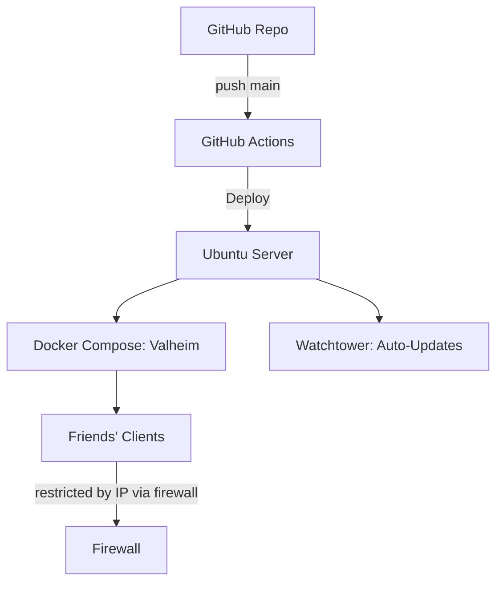

# Valheim Docker Server - Automated & Secure

---

## Project Overview
This repository provides the **infrastructure-as-code** needed to run a secure, automated Valheim dedicated server.  

It does not contain game files, world data, or secrets.  
Instead, it focuses on **deployment, automation, and security hardening** using Docker Compose, GitHub Actions, and DevSecOps principles.

- Dockerized Deployment — clean, portable, repeatable  
- Security-first — `.env` is excluded from Git, firewall restricts access to trusted IPs only  
- Automated Updates — Watchtower keeps the container fresh and patched  
- Backups & Cron Jobs — automatic world backups, configurable retention  

---

## Why I Created This
As a security engineer, I wanted to show how gaming projects can double as **practical DevSecOps case studies**.  

Hosting Valheim this way demonstrates:
- **Infrastructure as Code (IaC):** the server can be spun up or rebuilt consistently anywhere.  
- **Security Best Practices:** firewall rules, secret management, and least-privilege containers.  
- **Automation & CI/CD:** using GitHub Actions and Watchtower to keep services updated safely.  
- **Resilience & Backups:** world data is backed up and can be restored quickly.  

This repo is useful for anyone who wants to **learn secure container hosting** — whether for Valheim or for other self-hosted services.

---

## Architecture

Note: This repository contains infrastructure code only.
Sensitive configuration values (passwords, Steam tokens, backups) are never committed.
