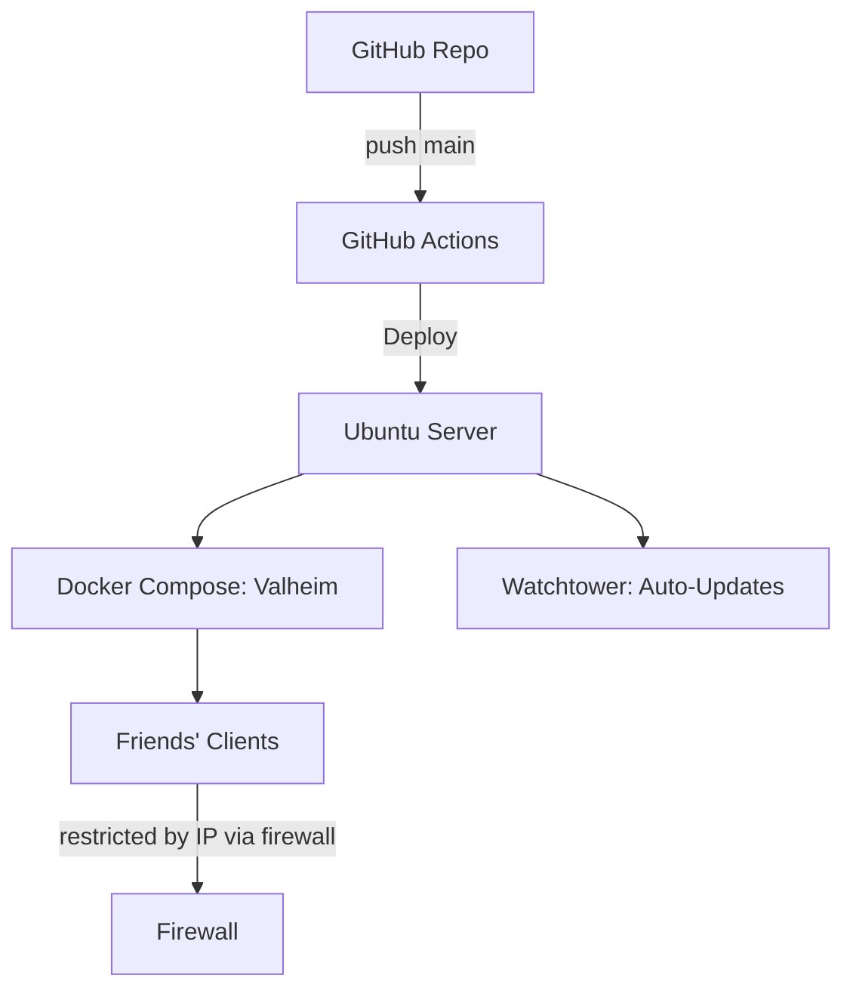

# Valheim Docker Server - Automated & Secure

[](https://github.com/MrGuato)
[](https://github.com/MrGuato/Valheim_Game_Server/actions/workflows/codeql.yml)
[](https://github.com/MrGuato/Valheim_Game_Server/actions/workflows/deploy.yml)
[](https://snyk.io/test/github/MrGuato/Valheim_Game_Server)
[]()
[]()

[]()

---

## Project Overview
This repository provides the **infrastructure** needed to run a secure, automated Valheim dedicated server.  

It does not contain game files, world data, or secrets.  
Instead, it focuses on **deployment, automation, and security hardening** using Docker Compose, GitHub Actions, and DevOps principles.

- Dockerized Deployment — clean, portable, repeatable  
- Security-first — `.env` is excluded from Git, firewall restricts access to trusted IPs only  
- Automated Updates — Watchtower keeps the container fresh and patched  
- Backups & Cron Jobs — automatic world backups, configurable retention  

---

## Why I Created This
I wanted to show how gaming projects can double as **practical DevOps, or even DevSecOps case studies**.  

Hosting Valheim this way demonstrates:
- **Infrastructure as Code (IaC):** the server can be spun up or rebuilt consistently anywhere.  
- **Security Best Practices:** firewall rules, secret management, and least-privilege containers.  
- **Automation & CI/CD:** using GitHub Actions and Watchtower to keep services updated safely.  
- **Resilience & Backups:** world data is backed up and can be restored quickly.  

This repo is useful for anyone who wants to **learn secure container hosting** — whether for Valheim or for other self-hosted services.

---

## Architecture


Note: This repository contains infrastructure code only.
Sensitive configuration values (passwords, Steam tokens, backups) are never committed.

## Setup Guide (Ubuntu Server)

This section documents the **end-to-end setup** process for running this Valheim server.  
Tested on: **Ryzen 5 1600, 16GB RAM, 240GB SSD** (Ubuntu 22.04/24.04 LTS).  
This repo serves as both the deployment source and the change log of infra updates.

---

### 1. Prepare the Server

Update and upgrade the system:
```bash
sudo apt update && sudo apt upgrade -y
sudo apt install -y curl ca-certificates gnupg lsb-release git ufw
```
Enable firewall with only SSH open initially:

```bash
sudo ufw default deny incoming
sudo ufw default allow outgoing
sudo ufw allow ssh
sudo ufw enable
```
### 2. Install Docker & Docker Compose

Add Docker’s official GPG key and repo:

```bash
sudo install -m 0755 -d /etc/apt/keyrings
curl -fsSL https://download.docker.com/linux/ubuntu/gpg | sudo gpg --dearmor -o /etc/apt/keyrings/docker.gpg
echo \
  "deb [arch=$(dpkg --print-architecture) signed-by=/etc/apt/keyrings/docker.gpg] \
  https://download.docker.com/linux/ubuntu $(lsb_release -cs) stable" | \
  sudo tee /etc/apt/sources.list.d/docker.list > /dev/null
```

Install Docker and Compose plugin:

```bash
sudo apt update
sudo apt install -y docker-ce docker-ce-cli containerd.io docker-compose-plugin
```

Add your user to the docker group:

```bash
sudo usermod -aG docker $USER
newgrp docker
```

Verify installation:

```bash
docker --version
docker compose version
```

### 3. Clone This Repository

```bash
git clone git@github.com:MrGuato/Valheim_Game_Server.git ~/gameserver
cd ~/gameserver
```

### 4. Configure Environment Variables
Copy the example file and edit:

```bash
cp .env.example .env
nano .env
```

Minimum values:

```ini
SERVER_NAME= MyValheim
WORLD_NAME=MyWorld
SERVER_PASS=StrongSecretHere
SERVER_PUBLIC=true
TZ=America/New_York
```

### 5. Launch the Server

Start the server:

```bash
docker compose up -d
```

Check logs:

```bash
docker compose logs -f
```

### 6. Configure Local Firewall & Firewall Forwarding

On the Ubuntu host (local firewall):

```bash
sudo ufw allow 2456:2457/udp
sudo ufw allow 2458/udp   # if crossplay enabled
```

On the Firewall controller:

Create a port forward rule from WAN → LAN for UDP 2456–2457 (and 2458 if crossplay).

Optionally restrict to your friends’ IPs (if you don’t need to appear on the public server list, or you'd prefer more security so people don't know your public IP).

### 7. Automated Backups
Backups are built into the Valheim container. Adjust .env:

```ini
BACKUPS=true
BACKUPS_CRON=5 * * * *      # hourly at minute 5
BACKUPS_MAX_AGE=3           # keep backups for 3 days
```

Backups will appear under ./backups.

For off-host safety, sync to another system:

```bash
rsync -av ~/gameserver/backups/ backup@nas:/srv/backups/valheim/
```

### 8. Automated Updates

This setup uses Watchtower to update only labeled containers.
Default schedule: daily at 05:00. Configure in compose.yaml:

```yaml
watchtower:
  image: containrrr/watchtower:latest
  restart: unless-stopped
  command: --label-enable --cleanup --schedule "0 5 * * *"
  volumes:
    - /var/run/docker.sock:/var/run/docker.sock
```

### 9. CI/CD Pipeline
This repo includes a GitHub Actions workflow:

- Validate: checks syntax (docker compose config)
- Deploy: connects over SSH, pulls changes, restarts services

Secrets required in GitHub:
- SSH_HOST
- SSH_USER
- SSH_PRIVATE_KEY
- (optional) SSH_PORT, DEPLOY_PATH

### 10. Connect to the Server
Public server list (if SERVER_PUBLIC=true and firewall allows Steam master servers). If you made your server public, but only allowed port forwarding on your firewall to selecr IP's, your server will NOT appear on the Valheim list. Please use below: 

Direct Connect:

```bash
<your.public.ip>:2456
```

If you don't know your public IP, go to your browser and go to IPCHicken to get your external IP. 

### Specs and Performance Notes
- CPU (Ryzen 5 1600): plenty of headroom for Valheim server (game is single-thread heavy, but 6c/12t is ample).
- RAM (16GB): Valheim uses ~2–4GB under load; leaves headroom for OS + other services.
- Storage (240GB SSD): world files and backups are small (MBs–GBs), so you have plenty of space.

### Security Reminder
This repository holds infra-as-code only.

- No secrets, world files, or backups are committed.
- .env is local-only, with an .env.example provided.
- GitHub Actions uses Secrets for all credentials.
